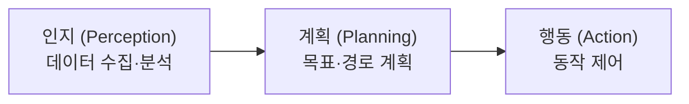

# Physical AI 강의 자료 개요

2026 TECH WEEK Physical AI 강의 슬라이드를 주제별 문서로 정리한 목록입니다. 원본은 저장소 루트의 [부산대 TECH WEEK Physical AI.pdf](../../../../부산대%20TECH%20WEEK%20Physical%20AI.pdf)이며 148장입니다. 원본 슬라이드의 저작권 표기는 "© 2026, 김규래 (Kyu Rae Kim). All rights reserved."입니다.

각 문서의 "슬라이드 N" 표기는 원본 PDF의 페이지 번호입니다. 그림과 도식은 원본 PDF에서 확인하십시오.

## 문서 구성

| 순서 | 문서 | 슬라이드 | 주요 내용 |
|---|---|---|---|
| 1 | 이 문서 | 1~8 | Physical AI 유형, AMR 정의, 인지·계획·행동 구조 |
| 2 | [센서](sensors.md) | 9~17 | LiDAR, IMU, GNSS, Wheel Encoder |
| 3 | [Computer Vision](computer-vision.md) | 18~50 | 이미지 배열, 색공간, 색상 분할, 외곽선, 객체 탐지, YOLO |
| 4 | [SLAM](slam.md) | 51~92 | Occupancy Grid Map, Odometry, ICP, Kalman Filter, Particle Filter, AMCL |
| 5 | [경로 계획](planning.md) | 93~105 | Costmap, Global Planner, Dijkstra, A\*, Frontier Exploration |
| 6 | [주행 제어](control.md) | 106~126 | Local Planner, 반응형 장애물 회피, Look-ahead 경로 추종 |
| 7 | [의사 결정](decision-making.md) | 127~147 | Finite State Machine, Behavior Tree |

과정 목표와 해커톤 조건은 [과정 안내](../../reference/course-overview.md)에 있습니다. COCO 클래스 ID는 [COCO 클래스 목록](../../reference/coco-classes.md)에 있습니다.

## Physical AI 유형

슬라이드 2는 Physical AI를 4가지 유형으로 구분합니다.

| 유형 | 예시 |
|---|---|
| 휴머노이드형 | 이족 보행 로봇 |
| 자율주행차형 | 자율주행 승용차 |
| 드론형 | 멀티콥터, 고정익 무인기 |
| 무인 운반차 및 자율주행 로봇형(AGV·AMR) | 물류 운반 로봇, 야외 주행 로봇, 사족 보행 로봇 |

## Autonomous Mobile Robot

자율 이동 로봇(AMR)의 특징은 다음 4가지입니다(슬라이드 3).

- 실시간 환경 인식, 장애물 회피, 최적 경로 생성
- AI·컴퓨터 비전·LiDAR 결합을 통한 인식·판단·제어 기능 고도화
- 공장, 물류센터, 건설 현장, 병원, 공항, 캠퍼스 등 산업 현장 활용
- 같은 작업 공간에서 인간 작업자와 안전하게 상호작용하는 협업

## 인지·계획·행동 구조

AMR의 처리 과정은 인지, 계획, 행동 3단계입니다(슬라이드 4~7). 강의는 이 순서로 진행합니다.

| 단계 | 수행 작업 | 관련 문서 |
|---|---|---|
| 인지 | 센서 기반 환경 데이터 수집, 전처리·특징 추출, 주변 환경·객체 인식, 로봇 위치·주변 상태 추정 | [센서](sensors.md), [Computer Vision](computer-vision.md), [SLAM](slam.md) |
| 계획 | 인지 정보 기반 환경 분석, 목표에 따른 행동 계획 수립, 목적지까지 최적 경로 생성, 환경 변화에 따른 실시간 계획 갱신 | [경로 계획](planning.md) |
| 행동 | 경로에 따른 이동 명령 생성, 속도·방향 제어, 주행 중 위치·자세 실시간 보정, 상황 변화에 따른 동작 제어 | [주행 제어](control.md), [의사 결정](decision-making.md) |

## 주제별 실습 파일

이 저장소의 Webots 컨트롤러와 강의 주제의 대응 관계입니다. 로봇 모델은 TurtleBot3입니다.

| 강의 주제 | 컨트롤러 | 내용 |
|---|---|---|
| 기본 주행 | `controllers/tb3_teleop/` | 키보드로 좌우 바퀴 속도 제어 |
| 센서 | `controllers/tb3_lidar/` | LDS-01 LiDAR 거리값 출력 |
| 센서 | `controllers/tb3_teleop_sensors/` | LiDAR, Wheel Encoder, 가속도계, 자이로, 나침반, 카메라 값 확인 |
| SLAM 검증 | `controllers/tb3_ground_truth/` | Supervisor 기반 실제 위치(Ground Truth) 확인 |
| Computer Vision | `controllers/tb3_cam/` | 카메라 이미지를 OpenCV 배열로 변환 |
| Computer Vision | `controllers/tb3_segmentation/` | LAB 색공간 임계값 마스크, 외곽선, 최소 외접원, 무게중심 계산 |
| Computer Vision | `controllers/tb3_teleop_cam/` | 키보드 주행 중 `tb3_segmentation`과 같은 색상 분할 수행 |
| 객체 탐지 | `controllers/tb3_teleop_yolo/` | `models/YOLO/yolo11n.pt` 기반 YOLO 탐지 |
