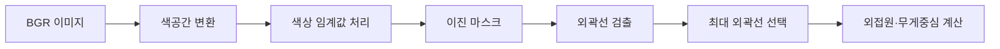

# Computer Vision

카메라 이미지에서 목표 물체를 찾는 방법을 정리한 문서입니다. 규칙 기반 색상 분할과 학습 기반 객체 탐지(YOLO)를 다룹니다. 원본은 강의 자료 슬라이드 18~50입니다.

Computer Vision은 컴퓨터가 시각 정보를 사람처럼 해석하고 이해하도록 만드는 기술입니다(슬라이드 18).

## 이미지 배열

이미지는 픽셀 값의 배열입니다(슬라이드 20~21).

| 항목 | 내용 |
|---|---|
| 인덱스 | `[row, col]`. row는 행(가로 줄), column은 열(세로 줄) |
| 픽셀 값 | 빛의 세기, `uint8`(0~255) |
| grayscale 형태 | `h * w` |
| color 형태 | `h * w * c`. c는 채널 수 |

OpenCV는 Computer Vision 분야에서 가장 널리 쓰는 오픈소스 라이브러리입니다(슬라이드 22). OpenCV는 컬러 이미지를 BGR 채널 순서로 저장합니다.

Webots 카메라 이미지는 BGRA 4채널 바이트 배열입니다. 실습 컨트롤러는 다음 순서로 OpenCV 배열을 생성합니다.

```python
image_bytes = camera.getImage()
frame_arr = np.frombuffer(image_bytes, np.uint8)
frame_bgra = frame_arr.reshape((height, width, 4))
frame_bgr = cv2.cvtColor(frame_bgra, cv2.COLOR_BGRA2BGR)
```

## 색공간

색공간은 색을 일정한 기준으로 표현하는 방식입니다(슬라이드 23~24). 색공간마다 표현 가능한 색의 범위(Color Gamut)가 다릅니다. 일관된 색 표현을 위해 처리 파이프라인의 색공간을 통일하십시오. 색공간 변환으로 이미지 전처리 효율을 높일 수 있습니다.

| 색공간 | 채널 | 특징 |
|---|---|---|
| RGB/BGR | 3 | 빛의 삼원색 조합. 밝기 변화에 값이 크게 변함 |
| RGBA | 4 | RGB에 투명도(alpha) 채널 추가. 형태 `h * w * 4` |
| CMYK | 4 | Cyan, Magenta, Yellow, Black. 인쇄용 감산 혼합 |
| HSV | 3 | Hue(색상), Saturation(채도), Value(명도) |
| HSL | 3 | Hue, Saturation, Lightness |

### HSV를 사용하는 이유

RGB 값은 조명 밝기에 따라 급격히 변합니다(슬라이드 33). HSV는 색상과 밝기를 분리해 표현합니다(슬라이드 28).

- H(Hue): 색의 종류
- S(Saturation): 색의 채도
- V(Value): 빛의 밝기

V 채널을 제외하고 H 채널을 사용하면 조명 영향을 줄인 순수 색상 정보로 판별할 수 있습니다. 이 특성으로 HSV는 조명 변화에 강한 색상 검출, 객체 인식, 이미지 전처리에 사용합니다.

실습 코드 `tb3_segmentation.py`는 HSV 대신 LAB 색공간(`cv2.COLOR_BGR2LAB`)으로 변환한 뒤 임계값을 적용합니다.

## 객체 탐지 방식 비교

객체 탐지(Object Detection)는 규칙 기반과 학습 기반으로 나뉩니다(슬라이드 29).

| 구분 | Rule-based | Learning-based |
|---|---|---|
| 특징 정의 | 사람이 직접 정의 | 데이터로부터 자동 학습 |
| 학습 데이터 | 불필요 | 필요 |
| 환경 변화 대응 | 낮음 | 상대적으로 높음 |
| 구현 난이도 | 단순한 문제에서는 쉬움 | 학습 과정 필요 |
| 복잡한 객체 처리 | 어려움 | 상대적으로 유리 |
| 대표 기술 | HSV Mask, Contour, Haar Cascade | CNN, R-CNN, YOLO |

## 규칙 기반 탐지

규칙 기반 탐지는 색상 등 사람이 정의한 특징으로 객체를 찾습니다(슬라이드 30). 처리 순서는 다음과 같습니다.



### 색상 분할

색상 분할(Color Segmentation)은 원하는 특정 색상만 분리·추출하는 기법입니다(슬라이드 31). 방법은 색상 임계값 처리(Color Thresholding)이며 결과는 이진 마스크(Binary Mask)입니다.

이진 마스크는 흰색과 검은색 2가지 값으로 표현합니다(슬라이드 32). 원하는 색은 255(흰색), 나머지 색은 0(검은색)으로 변환합니다.

```python
mask = cv2.inRange(lab, lower, upper)
```

### 외곽선

외곽선(Contour)은 마스크에서 흰색 영역의 경계입니다(슬라이드 34~35).

```python
contours, hierarchy = cv2.findContours(mask, cv2.RETR_EXTERNAL, cv2.CHAIN_APPROX_SIMPLE)
contour = max(contours, key=cv2.contourArea)
```

| 인자 | 의미 |
|---|---|
| `cv2.RETR_EXTERNAL` | 구멍 뚫린 객체의 바깥쪽 테두리만 검출 |
| `cv2.CHAIN_APPROX_SIMPLE` | 직선 경로 위 픽셀 전체 대신 꼭짓점 좌표만 저장 |
| `key=cv2.contourArea` | 면적이 가장 넓은 외곽선 선택 |
| `key=cv2.arcLength` | 둘레가 가장 긴 외곽선 선택. 호출 시 `closed` 인자 필요 |

### 최소 외접원과 무게중심

최소 외접원(Minimum Enclosing Circle)은 외곽선의 모든 점을 포함하는 가장 작은 원입니다(슬라이드 36). 무게중심(Centroid)은 외곽선 내부 픽셀 분포로 계산한 객체의 중심 좌표입니다(슬라이드 37). 무게중심은 픽셀 가중치 합을 전체 면적으로 나눈 값입니다.

```python
(x, y), radius = cv2.minEnclosingCircle(contour)

M = cv2.moments(contour)
cX = int(M["m10"] / M["m00"])
cY = int(M["m01"] / M["m00"])
```

`M["m00"]`은 면적입니다. 면적이 0이면 나눗셈 오류가 발생하므로 실습 코드는 `M["m00"] != 0`을 먼저 확인합니다.

## 학습 기반 탐지

객체 탐지는 객체 위치 추정(Object Localization)과 객체 분류(Object Classification)의 결합입니다(슬라이드 39). 분류는 이미지 전체의 클래스 1개를 예측합니다. 탐지는 이미지 안의 여러 객체마다 위치와 클래스를 예측합니다(슬라이드 40~41).

학습 기반 탐지 모델의 출력은 다음 3가지입니다(슬라이드 42).

| 질문 | 출력 |
|---|---|
| 어디에 있는지 | Bounding Box |
| 무엇인지 | Class |
| 얼마나 확실한지 | Confidence |

### Bounding Box

Bounding Box(BBox)는 탐지된 객체를 둘러싸는 직사각형 영역입니다(슬라이드 43). OpenCV 이미지 좌표계는 좌측 상단이 원점 (0, 0)입니다. x는 오른쪽으로 증가하고 y는 아래쪽으로 증가합니다. 원본 슬라이드 43에는 y 증가 방향이 "왼쪽"으로 표기되어 있습니다.

BBox 표현 방식은 4가지입니다(슬라이드 44).

| 번호 | 형식 | 의미 |
|---|---|---|
| 1 | `(x1, y1, x2, y2)` | 좌측 상단과 우측 하단 좌표 |
| 2 | `(x, y, w, h)` | 좌측 상단 좌표와 너비·높이 |
| 3 | `(cx, cy, w, h)` | 중심 좌표와 너비·높이 |
| 4 | `(cx_norm, cy_norm, w_norm, h_norm)` | 이미지 크기로 정규화한 중심 좌표와 너비·높이 |

### Two-stage와 One-stage 비교

| 구분 | Two-stage | One-stage |
|---|---|---|
| 탐지 과정 | 후보 영역 생성 후 분류 | 한 번에 직접 예측 |
| 후보 영역 | 명시적으로 생성 | 별도 생성 단계 없음 |
| 처리 구조 | 복잡함 | 상대적으로 단순함 |
| 추론 속도 | 상대적으로 느림 | 상대적으로 빠름 |
| 작은 객체·정밀 탐지 | 유리한 경우가 많음 | 모델 구조에 따라 다름 |
| 실시간 처리 | 상대적으로 불리함 | 유리함 |
| 대표 모델 | Faster R-CNN | YOLO |

원본은 슬라이드 45입니다.

### YOLO

YOLO(You Only Look Once)는 CNN 기반 One-stage Detector입니다(슬라이드 47~48). 이미지 전체를 신경망에 1회 입력해 이미지 속 객체를 모두 탐지합니다. 각 객체의 위치(Bounding Box), 종류(Class), 신뢰도(Confidence)를 동시에 예측합니다.

YOLO가 실시간 처리에 적합한 이유는 다음과 같습니다.

- 별도의 Region Proposal 단계가 없음
- 여러 객체가 Feature Map을 공유함
- 여러 위치의 예측을 병렬로 계산해 GPU 병렬 연산을 효율적으로 활용함
- 작은 모델부터 큰 모델까지 선택 가능함

실습 코드 `tb3_teleop_yolo.py`는 Ultralytics YOLO의 `yolo11n.pt` 모델을 사용합니다.

```python
model = YOLO("../../models/YOLO/yolo11n.pt")
results = model.predict(source=frame_bgr, conf=0.1, iou=0.5, classes=None)
```

| 인자 | 값 | 의미 |
|---|---|---|
| `conf` | 0.1 | 이 값 미만의 Confidence 결과 제외 |
| `iou` | 0.5 | 중복 박스 제거 기준 IoU |
| `classes` | `None` | 전체 클래스 탐지. `[47]`이면 사과만 탐지 |

저장소의 `models/YOLO/`에는 `.gitkeep`만 있습니다. 실행 전에 `yolo11n.pt`를 이 폴더에 준비하십시오.

`yolo11n.pt`는 COCO 데이터셋으로 학습한 모델입니다. 클래스 ID는 [COCO 클래스 목록](../../reference/coco-classes.md)에 있습니다.
