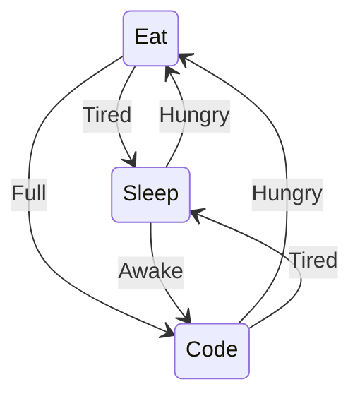
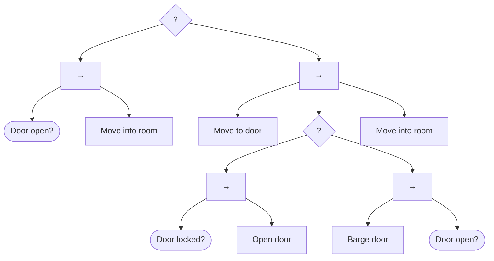

# 의사 결정

로봇의 다음 행동을 선택하는 구조를 정리한 문서입니다. Finite State Machine(FSM)과 Behavior Tree(BT)를 다룹니다. 원본은 강의 자료 슬라이드 127~147입니다.

## Finite State Machine

FSM은 상태(State)와 전이(Transition)로 구성한 그래프 구조입니다(슬라이드 128). 슬라이드의 예시는 다음과 같습니다.



FSM이 적합한 조건은 다음과 같습니다.

- 동작 프로세스가 단순하고 순차적인 경우
- 상태 개수가 적고 상태 사이 관계가 복잡하지 않은 경우

상태와 전이 조건 수가 증가하면 복잡도가 기하급수적으로 상승합니다. [주행 제어](control.md)의 Yaw 기반 장애물 회피는 `MOVE`, `TURN` 2개 상태의 FSM입니다(슬라이드 129).

## Behavior Tree

Behavior Tree는 노드로 구성한 트리 구조입니다(슬라이드 130). BT가 적합한 조건과 특징은 다음과 같습니다.

- 다양한 조건과 예외 처리가 복잡하게 얽힌 경우에 적합함
- 조건에 따라 동작을 유연하게 선택해 실행함
- 노드를 추가·변경해도 기존 로직에 미치는 영향이 적음
- 복잡한 행동과 예외 상황을 구조적으로 관리할 수 있음

### FSM과 BT 비교

| 구분 | FSM | Behavior Tree |
|---|---|---|
| 구조 | 그래프 | 트리 |
| 구성 요소 | State, Transition | Node |
| 적합한 문제 | 단순·순차적 동작, 적은 상태 수 | 조건·예외 처리가 많은 동작 |
| 확장 시 영향 | 상태·전이 증가에 따라 복잡도 급증 | 노드 추가·변경의 영향이 국소적 |

### 트리 용어

슬라이드 131의 트리 용어는 Node, Parent/Child, Root, Grandparent/Grandchild, Branch, Uncle/Nephew, Leaf, Sibling, Blackboard입니다. Blackboard는 노드 사이에서 공유하는 데이터 저장소입니다.

### 노드 종류

| 분류 | 종류 | 노드 |
|---|---|---|
| 실행 노드(Leaf) | Task/Action | 실제 동작 수행 |
| 실행 노드(Leaf) | Condition | 조건 확인 |
| 제어 노드(Internal) | Composite | Selector, Sequence, Parallel |
| 제어 노드(Internal) | Decorator | Inverter, Loop, Repeater, Succeeder, Failer |

원본은 슬라이드 132~133입니다. 슬라이드 도식에서 `?`는 Selector(Fallback), `→`는 Sequence입니다.

### 노드 실행 규칙

BT 노드의 실행 규칙은 다음과 같습니다(슬라이드 134).

- 모든 노드는 Success(S), Failure(F), Running(R) 중 하나를 반환함
- 제어 노드는 Child의 결과에 따라 다음 실행 흐름을 결정함
- 결과는 Parent 방향으로 전달됨(Bubble Up)
- 트리는 Tick 단위로 평가·실행됨

### 제어 노드 반환 조건

| 노드 | 실행 순서 | Success | Failure | Running | 다음 Tick |
|---|---|---|---|---|---|
| Selector, Fallback | 왼쪽에서 오른쪽 | Child 1개 이상 성공 | 전체 실패 | Child 1개 이상 Running | Running Child부터 검사(메모리 기반) |
| Sequence | 왼쪽에서 오른쪽 | 전체 성공 | Child 1개 이상 실패 | Child 1개 이상 Running | Running Child부터 검사(메모리 기반) |
| Parallel | 전체 동시 실행 | 성공 수 ≥ Success Count | 실패 수 ≥ Failure Count | S·F 조건 미충족 | 전체 Child 재실행(메모리 없음) |
| Reactive Fallback | 왼쪽에서 오른쪽 | Child 1개 이상 성공 | 전체 실패 | Child 1개 이상 Running | 전체 Child 재평가(메모리 없음) |
| Reactive Sequence | 왼쪽에서 오른쪽 | 전체 성공 | Child 1개 이상 실패 | Child 1개 이상 Running | 전체 Child 재평가(메모리 없음) |

원본은 슬라이드 135~140입니다. 슬라이드 135의 Selector와 슬라이드 138의 Fallback은 같은 규칙입니다.

Reactive 노드는 매 Tick마다 앞쪽 Condition을 다시 확인합니다. 따라서 Action 실행 중 조건이 바뀌면 즉시 다른 Child로 전환할 수 있습니다.

### 특수 제어 노드

| 노드 | 동작 | 슬라이드 |
|---|---|---|
| Pipeline Sequence | Reactive Sequence와 같은 로직. Running Child를 만나도 기존 수행 작업을 계속 진행함. 지연(Latency)이 있어도 Pipeline을 중단하지 않음 | 141 |
| Recovery Node | Child 2개로 제한. Child 1은 주 행동, Child 2는 실패 시 회복 행동(예: 주행 실패 시 제자리 회전) | 142 |
| Round Robin | Running Child부터 다시 검사하고 Child가 Running이면 Parent도 Running 반환. Child가 S·F를 반환하면 다음 Tick에서 다음 Child 실행 | 143 |

Pipeline Sequence의 예시는 다음과 같습니다.

| 예시 | Camera Input | Detection | Action |
|---|---|---|---|
| 1 | S | R | 실행 안 함 |
| 2 | R | S | S |

Recovery Node의 반환 조건은 다음과 같습니다.

| 결과 | 조건 |
|---|---|
| Success | Child 1(주 행동) 성공 |
| Failure | Child 2(회복 행동) 실패 |
| Failure | 재시도 횟수 초과 |

### 문 진입 예시

슬라이드 132~144는 방에 들어가는 BT를 예시로 사용합니다.



문이 열려 있으면 첫 번째 Sequence가 성공하고 방에 들어갑니다. 문이 닫혀 있으면 두 번째 Sequence가 문으로 이동합니다. 이후 문을 여는 방법 2가지를 차례로 시도하고 방에 들어갑니다.

## 청소 로봇 예시

슬라이드 145~147은 같은 청소 로봇 동작을 FSM과 BT로 구현한 예시입니다. 동작 조건은 배터리 부족 시 충전대 복귀, 오염 감지 시 청소, 그 외 대기입니다.

FSM 구현은 다음과 같습니다(슬라이드 146).

```python
while True:
    if state == IDLE:
        if IsBatteryLow():
            state = GO_HOME
        elif IsDirty():
            state = CLEANING
    elif state == CLEANING:
        Clean()
        state = IDLE
    elif state == GO_HOME:
        GoHome()
        state = DOCK
    elif state == DOCK:
        Dock()
        state = IDLE
```

BT 구현은 다음과 같습니다(슬라이드 147).

```python
tree = Parallel([
    Sequence([
        IsBatteryLow(),
        GoHome(),
        Dock()
    ]),
    Selector([
        Sequence([
            IsDirty(),
            Clean()
        ]),
        Idle()
    ])
])
```

BT 구현에서 배터리 복귀 동작과 청소 동작은 Parallel 아래의 독립 Branch입니다. 새 동작을 추가할 때는 해당 Branch에 노드만 추가하면 됩니다. FSM 구현에서는 기존 상태의 전이 조건도 함께 수정해야 합니다.
