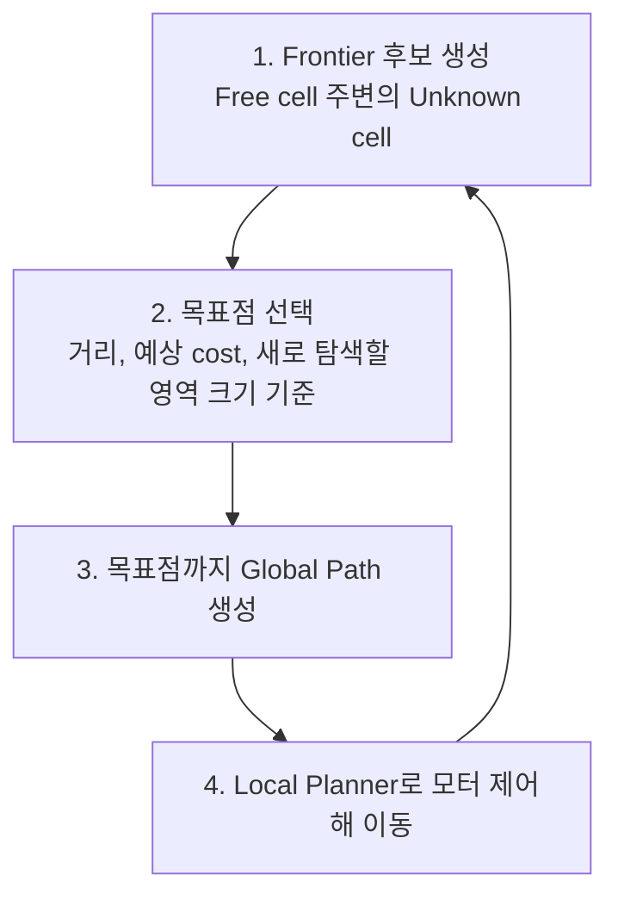

# 경로 계획

인지 정보로 목적지까지의 경로를 계산하는 방법을 정리한 문서입니다. Costmap, Global Planner, 미지 환경 탐험(Frontier Exploration)을 다룹니다. 원본은 강의 자료 슬라이드 93~105입니다.

계획(Planning) 단계의 작업은 다음 4가지입니다(슬라이드 94).

- 인지 정보 기반 환경 상황 분석
- 주어진 목표에 따른 행동 계획 수립
- 목적지까지의 최적 경로 생성
- 환경 변화에 따른 계획의 실시간 갱신

## 용어

| 용어 | 정의 |
|---|---|
| Global Planner | 시작점에서 목표점까지의 경로를 계산하는 시스템·모듈 |
| Global Path | Global Planner가 계산한 시작점에서 목표점까지의 전체 이동 경로 |
| Local Planner/Controller | 현재 위치와 주변 환경을 고려해 가까운 구간의 움직임을 계산·제어하는 시스템·모듈 |
| Local Path | Local Planner/Controller가 현재 움직임 제어에 사용하는 가까운 구간의 경로 |

원본은 슬라이드 95입니다.

## Costmap

Costmap(비용 지도)은 안전한 경로 계획을 위해 주변 환경 정보를 2차원 격자로 수치화한 지도입니다(슬라이드 96~97).

- Occupancy Grid Map은 장애물 여부만 표현함(trinary)
- 충돌 여부를 판단하려면 로봇 크기를 고려해야 함
- Costmap은 Occupancy Grid Map 위에 안전 거리와 장애물 정보를 계층으로 추가한 지도임
- 공간의 위험도를 비용(cost)으로 표현함
- 각 cell은 1 byte(`uint8`, 0~255)임

### Cost 값

| 값 | 영역 | 의미 |
|---|---|---|
| 255 | Unknown Area | 미관측·데이터 부족 영역. Global Planner는 기본적으로 이 영역을 회피함 |
| 254 | Occupied Area | 실제 벽·장애물 좌표. 닿으면 무조건 충돌하는 치명적 장애물 영역 |
| 253 | Inscribed/Collision Area | 장애물은 아니지만 로봇 중심이 진입하면 로봇 외곽이 장애물과 충돌하는 경계 |
| 1~252 | Traversable/Inflation Area | 장애물에 가까울수록 값이 커지는 팽창 영역. Planner는 이 값으로 벽에서 먼 경로를 계산함 |
| 0 | Free Space | 장애물이 없어 최고 속도로 주행 가능한 영역 |

원본은 슬라이드 98~99입니다.

### Global Costmap과 Local Costmap 비교

| 구분 | Global Costmap | Local Costmap |
|---|---|---|
| 범위 | 지도 전체 | 로봇 중심의 작은 사각형(rolling window) |
| 기준 좌표계 | Map Frame | 로봇 Frame. 로봇 이동에 따라 지도가 함께 이동 |
| 용도 | Global Planner의 Global Path 계산 | Local Planner의 장애물 회피 경로(local path)와 제어 명령(local control) |

원본은 슬라이드 100입니다.

## Global Planner

Global Planner는 Global Costmap으로 전체 경로를 계획합니다(슬라이드 101). 연산량이 많으므로 최초 1회, 이벤트 발생 시, 또는 약 1Hz의 느린 주기로 계산합니다. 대표 알고리즘은 Dijkstra와 A\*입니다.

### Dijkstra

| 항목 | 내용 |
|---|---|
| 탐색 방식 | 출발지부터 모든 격자를 탐색해 최소 비용 경로 계산 |
| 비용 | 각 노드까지의 누적 비용 점수 부여 |
| 평가 함수 | $f(n) = g(n)$ |
| 장점 | 최적 경로 보장 |
| 단점 | 연산량과 메모리 사용량이 큼 |

원본 슬라이드 102는 Dijkstra를 BFS(Breadth-First Search)와 같은 확장 방식으로 설명합니다. 모든 이동 비용이 같으면 Dijkstra와 BFS의 탐색 결과는 같습니다.

### A\*

| 항목 | 내용 |
|---|---|
| 탐색 방식 | Dijkstra에 Heuristic을 추가해 목적지 방향을 우선 탐색 |
| 비용 | 현재 노드까지의 비용과 목적지까지의 추정 거리 합 |
| Heuristic | 주로 맨해튼 거리 또는 유클리드 거리 |
| 평가 함수 | $f(n) = g(n) + h(n)$ |
| 장점 | 빠른 속도, 적은 연산량과 메모리 |
| 단점 | 비교적 덜 최적화된 경로(슬라이드 103 기준) |

Heuristic $h(n)$이 실제 남은 비용 $h^*(n)$보다 크지 않으면($h(n) \le h^*(n)$, admissible) A\*도 최단 경로를 보장합니다. 4방향 격자에서는 맨해튼 거리, 8방향 또는 연속 공간에서는 유클리드 거리가 이 조건을 만족합니다.

## Frontier Exploration

지도가 주어지지 않는 환경에서는 탐험(Exploration)으로 지도를 확장합니다(슬라이드 104~105). Frontier는 Free cell과 맞닿은 Unknown cell입니다.

이동 중 LiDAR scan으로 지도가 갱신되면 Frontier도 다시 계산합니다. 남은 Frontier가 없으면 탐색 가능한 영역을 모두 탐색한 상태입니다.
