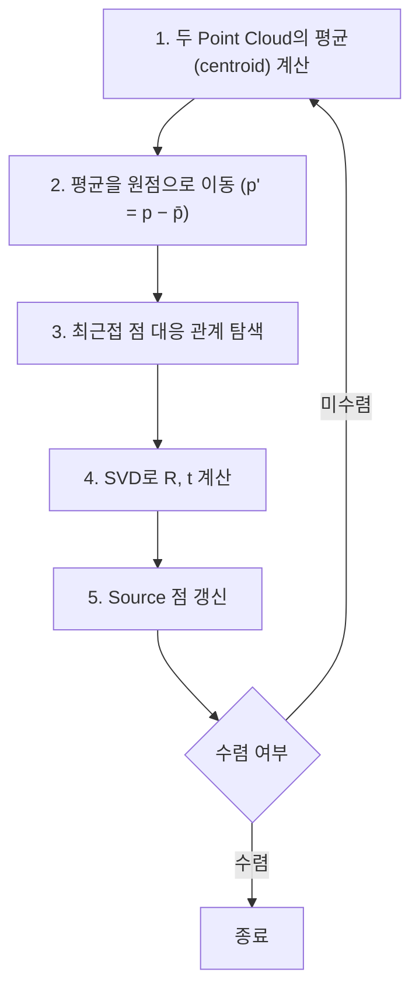
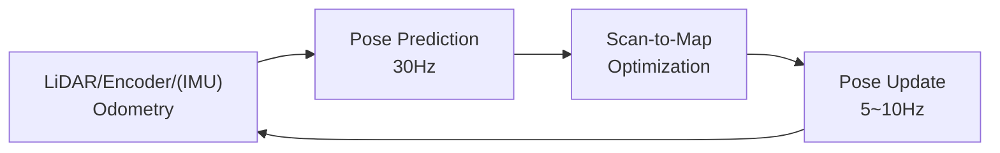

# SLAM

SLAM(Simultaneous Localization And Mapping)은 로봇이 이동하면서 지도 작성(Mapping)과 위치 추정(Localization)을 동시에 수행하는 기술입니다. 원본은 강의 자료 슬라이드 51~92입니다.

## 입력과 출력

| 구분 | 항목 |
|---|---|
| 입력 | 카메라 이미지, LiDAR laser scan, IMU orientation, 바퀴 Encoder, GNSS |
| 출력 | Map(2D map, Point Cloud, Mesh, Topology), Robot pose(x, y, z, w) |

원본은 슬라이드 52입니다.

## Mapping

### Occupancy Grid Map

Occupancy Grid Map은 지도를 격자(grid)로 나누고 각 칸(cell)의 상태를 정의한 지도입니다(슬라이드 53). cell 상태는 다음 3가지입니다.

| 상태 | 의미 |
|---|---|
| Free | 빈 공간 |
| Occupied | 장애물 |
| Unknown | 미관측, 데이터 부족 |

현실 공간의 거리(m)는 지도에서 픽셀(cell) 단위로 변환합니다. 변환 비율은 cell 1개가 나타내는 거리(해상도)입니다.

### Cell 점유 확률 계산

각 cell의 점유 확률은 Bayesian Filter로 갱신합니다(슬라이드 54). 0은 free, 1은 occupied입니다. 모든 cell의 초기 확률은 $P(c_i = \text{occ})_{t=0} = 0.5$입니다.

$$
\begin{aligned}
P(c_i = \text{occ} \mid z_{1:t}, x_{1:t})
&= \frac{P(z_t \mid c_i = \text{occ})\, P(c_i = \text{occ} \mid z_{1:t-1})}{P(z_t \mid z_{1:t-1})} \\[1ex]
&= \frac{P(\text{hit} \mid \text{occ})\, P(\text{occ} \mid \text{prev}_z)}{P(\text{hit} \mid \text{prev}_z)}
\end{aligned}
$$

- $z$: 센서 측정값
- $x$: 로봇 위치
- $\text{hit}$: 이번 측정에서 해당 cell에 레이저가 닿은 사건
- $\text{prev}_z$: 이전까지의 측정값

### Occupancy 데이터 저장 방식

슬라이드 55는 점유 값 저장 방식 4가지를 비교합니다.

| 방식 | 값 범위 | 장점 | 단점 |
|---|---|---|---|
| 확률값 보존 | 0~1 | 원본 정보를 직관적으로 보존 | 고정밀 실수 데이터 부담, Underflow 위험 |
| 정수형 Scaling | 0~100 | 메모리 절감, 연산 단순화 | 정밀도 손실 |
| Log Space 변환 | $(-\infty, 0]$ | Underflow 방지, 작은 확률의 안정적 표현, Throughput 향상 | 원본 미기재 |
| Trinary 표현 | 0/100/−1 | 강제 영역 분리로 센서 노이즈 제거, 고속 판별 | 정보 유실로 분석·디버깅 불가 |

Trinary 표현에서 0은 free, 100은 occupied, −1은 unknown입니다.

## Localization

Localization은 로봇이 미리 만든 지도 위에서 자신의 위치 $(x, y, \theta)$를 추정하는 문제입니다(슬라이드 56). 강의는 측정값만으로 추정하는 방법과 확률 기반 추정 방법을 순서대로 다룹니다.

### 측정값 기반 추정

IMU의 측정 항목은 다음 3가지입니다(슬라이드 57).

| 센서 | 측정 값 |
|---|---|
| Accelerometer | 선형 가속도 |
| Gyroscope | 각속도 |
| Magnetometer | 절대 방위 |

Wheel Encoder는 Pulse Count로 바퀴 이동 거리를 계산합니다. 두 바퀴의 이동 거리로 로봇 이동 거리와 회전 각도를 계산합니다(슬라이드 58).

### Wheel Odometry

차동 구동 로봇(Differential Drive Robot)은 좌우 바퀴 속도 차이로 회전합니다. 변수는 다음과 같습니다(슬라이드 59~62).

| 변수 | 의미 |
|---|---|
| $R$ | 바퀴 반지름(WheelRadius) |
| $L$ | 좌우 바퀴 간격(WheelSeparation) |
| $C_l$, $C_r$ | 좌우 Encoder Pulse Count |
| $\text{PPR}$ | 바퀴 1회전당 Pulse 수(Pulse Per Revolution) |
| $\varphi_l$, $\varphi_r$ | 좌우 바퀴 회전각(rad) |

계산 순서는 다음과 같습니다.

**1. 바퀴 이동 거리**

Pulse Count 또는 바퀴 회전각으로 계산합니다.

$$
d_l = \frac{C_l}{\text{PPR}} \cdot 2\pi R = R\,\varphi_l, \qquad
d_r = \frac{C_r}{\text{PPR}} \cdot 2\pi R = R\,\varphi_r
$$

**2. 로봇 이동 거리와 회전 각도**

$$
\Delta s = \frac{d_r + d_l}{2}, \qquad
\Delta\theta = \frac{d_r - d_l}{L}
$$

**3. 회전 반지름과 이동 후 위치 (로봇 기준 좌표)**

$$
R_c = \frac{\Delta s}{\Delta\theta}, \qquad
x = R_c \sin\Delta\theta, \qquad
y = R_c\,(1 - \cos\Delta\theta)
$$

$\Delta\theta = 0$이면 직진이므로 $R_c$를 계산하지 않고 $x = \Delta s$, $y = 0$을 사용하십시오. Webots의 바퀴 `PositionSensor`는 회전각(rad)을 반환하므로 $d = R\,\varphi$ 식을 사용합니다.

### Scan Matching

Scan Matching은 2개의 laser scan 또는 scan과 지도를 비교해 위치 변화를 계산하는 방법입니다(슬라이드 63, 71~72).

| 종류 | 비교 대상 | 용도 |
|---|---|---|
| Scan-to-Scan Matching | 현재 scan과 과거 scan | LiDAR Odometry |
| Scan-to-Map Matching | 현재 scan과 지도 | Localization |

### ICP

ICP(Iterative Closest Point)는 두 Point Cloud의 위치를 정합하는 알고리즘입니다(슬라이드 64~70). 각 점의 가장 가까운 점을 대응 관계로 찾고 Rotation과 Translation을 반복 계산합니다. 오차가 최소화되거나 수렴하면 종료합니다.



4단계의 계산식은 다음과 같습니다(슬라이드 65).

$$
\begin{aligned}
H &= P'^{\mathsf{T}} Q' = U \Sigma V^{\mathsf{T}} \\
R &= V U^{\mathsf{T}} =
\begin{bmatrix} \cos\theta & -\sin\theta \\ \sin\theta & \cos\theta \end{bmatrix} \\
t &= \bar{q} - R\,\bar{p}
\end{aligned}
$$

```python
U, S, V_t = np.linalg.svd(H)
R = V_t.T @ U.T
```

3단계의 최근접 점 탐색은 `scipy.spatial.cKDTree` 또는 `sklearn.neighbors.NearestNeighbors`로 구현할 수 있습니다(슬라이드 70). 두 Point Cloud의 점 순서가 같다고 가정하면 안 됩니다.

#### ICP 계산 예시

슬라이드 66~68의 예시입니다. $P$를 $90^\circ$ 회전하면 $Q$가 됩니다. 행렬의 각 행은 점 1개의 $(x, y)$ 좌표입니다.

$$
P = \begin{bmatrix} 1 & 0 \\ 0 & 1 \\ -1 & 0 \end{bmatrix}, \quad
\bar{p} = \left(0,\ \tfrac{1}{3}\right), \qquad
Q = \begin{bmatrix} 0 & 1 \\ -1 & 0 \\ 0 & -1 \end{bmatrix}, \quad
\bar{q} = \left(-\tfrac{1}{3},\ 0\right)
$$

$$
P' = \begin{bmatrix} 1 & -\tfrac{1}{3} \\ 0 & \tfrac{2}{3} \\ -1 & -\tfrac{1}{3} \end{bmatrix}, \qquad
Q' = \begin{bmatrix} \tfrac{1}{3} & 1 \\ -\tfrac{2}{3} & 0 \\ \tfrac{1}{3} & -1 \end{bmatrix}
$$

$$
H = P'^{\mathsf{T}} Q' = \begin{bmatrix} 0 & 2 \\ -\tfrac{2}{3} & 0 \end{bmatrix}, \qquad
U = \begin{bmatrix} 1 & 0 \\ 0 & -1 \end{bmatrix}, \qquad
V = \begin{bmatrix} 0 & 1 \\ 1 & 0 \end{bmatrix}
$$

$$
R = V U^{\mathsf{T}} = \begin{bmatrix} 0 & -1 \\ 1 & 0 \end{bmatrix} \ (\theta = 90^\circ), \qquad
t = \bar{q} - R\,\bar{p} = (0,\ 0)
$$

원본 슬라이드 68은 $H$의 $(2, 1)$ 성분을 $-1$로 표기합니다. NumPy 계산 값은 $-\tfrac{2}{3}$이며 회전 결과($\theta = 90^\circ$)는 같습니다.

### 시뮬레이션 전제

강의의 Localization 실습은 다음 전제를 사용합니다(슬라이드 73).

- Kidnapped Robot Problem은 다루지 않음
- 로봇 이동은 연속적임
- 초기 위치와 방향(Initial Position & Orientation)을 알고 시작함
- Odometry만으로도 위치 추정이 가능함

### Prediction과 Update 주기

위치 추정은 Prediction과 Update를 반복합니다(슬라이드 74~75).



Odometry 기반 Pose Prediction은 30Hz로 실행합니다. Scan-to-Map 기반 Pose Update는 5~10Hz로 실행합니다. SLAM은 같은 tick 안에서 위치 추정과 지도 갱신을 모두 완료합니다(슬라이드 92).

## Bayesian Estimation

### Kalman Filter

Kalman Filter는 움직임 예측값과 측정값을 결합해 상태를 추정합니다(슬라이드 76). 1회 갱신의 입력은 $\mu_{t-1}$, $\Sigma_{t-1}$, $u_t$, $z_t$이고 출력은 $\mu_t$, $\Sigma_t$입니다.

| 단계 | 계산식 |
|---|---|
| 상태 예측 | $\bar{\mu}_t = A_t \mu_{t-1} + B_t u_t$ |
| 공분산 예측 | $\bar{\Sigma}_t = A_t \Sigma_{t-1} A_t^{\mathsf{T}} + R_t$ |
| Kalman gain | $K_t = \bar{\Sigma}_t C_t^{\mathsf{T}} \left( C_t \bar{\Sigma}_t C_t^{\mathsf{T}} + Q_t \right)^{-1}$ |
| 측정값으로 상태 보정 | $\mu_t = \bar{\mu}_t + K_t \left( z_t - C_t \bar{\mu}_t \right)$ |
| 공분산 보정 | $\Sigma_t = \left( I - K_t C_t \right) \bar{\Sigma}_t$ |

| 기호 | 의미 |
|---|---|
| $\mu$ | state estimate |
| $\Sigma$ | estimate covariance matrix |
| $u$ | control |
| $z$ | measurement |
| $A$ | state transition model |
| $B$ | control input model |
| $C$ | observation model |
| $R$ | process noise covariance matrix |
| $Q$ | measurement noise covariance matrix |
| $K$ | Kalman gain |

$Q$는 슬라이드 수식에만 있고 기호 설명에는 없습니다. 표의 $Q$ 설명은 Kalman Filter의 표준 정의입니다.

| 구분 | 내용 |
|---|---|
| 장점 | 과거 state 반영으로 높은 정확도, 센서 노이즈 배제, 움직임 예측과 측정 보정 결합, 추정 위치를 Gaussian 분산으로 표현, 센서 고장·유실 시에도 예측 가능, CV tracking에 유리 |
| 단점 | 초기값이 없으면 매우 불안정, 선형·Gaussian 상태 추정 문제에 국한, 위치 1개만 예측 |

원본은 슬라이드 77~78입니다.

### Deterministic과 Stochastic 비교

| 구분 | Deterministic(결정론적) | Stochastic(확률론적) |
|---|---|---|
| 추정 방식 | 위치 1개만 예측 | 확률 분포로 pose 추론 |
| 유사·대칭 구조 | 취약함 | 여러 후보 가능성을 유지함 |

원본은 슬라이드 79입니다.

### Monte Carlo 추정

Monte Carlo 추정은 랜덤 샘플을 많이 뽑아 확률을 근사하는 방법입니다(슬라이드 80). 샘플 수가 많을수록 실제 값으로 수렴합니다. 오차는 샘플 수 $n$에 대해 $1/\sqrt{n}$ 비율로 감소합니다.

### Particle Filter

Particle Filter는 Monte Carlo 샘플(Particle)로 로봇의 가능한 위치를 표현합니다(슬라이드 81). Particle은 지도 위에 분포시킨 점이며 각 점은 로봇 위치 후보 1개입니다. 처리 과정은 4단계입니다(슬라이드 82~86).

| 단계 | 처리 내용 |
|---|---|
| 1. Initialization | Particle을 지도 전체에 랜덤 배치. 모든 가중치를 $1/n$으로 설정 |
| 2. Prediction | 로봇 이동량만큼 Particle 이동. Encoder 오차와 바퀴 미끄러짐을 반영한 노이즈 추가 |
| 3. Update | 실제 LiDAR scan과 각 Particle 위치의 지도 기반 expected scan 비교. $P(\text{sensor} \mid \text{particle})$로 가중치 부여 후 정규화 |
| 4. Resampling | 가중치에 비례하는 확률로 $n$개 재추출(중복 허용). 가능성이 낮은 Particle 제거 |

#### Resampling 문제와 해결책

Resampling을 반복하면 좋은 Particle만 복제되어 다양성이 낮아집니다(슬라이드 87). 그 결과 여러 가설 대신 가설 1개만 남아 Local minima에 갇힙니다. Particle Filter는 여러 가능성을 동시에 유지해야 합니다.

| 해결책 | 방법 |
|---|---|
| 샘플 수 증가 | Particle 개수 확대 |
| Jittering | 복제 후 노이즈 추가 |
| Systematic Resampling | CDF 구간별로 선택 |
| Adaptive Resampling | ESS가 낮을 때만 Resampling 수행 |

ESS(Effective Sample Size)는 현재 Particle 중 실제로 유효한 샘플 수입니다(슬라이드 89). ESS는 정보량에 비례합니다. Adaptive Resampling으로 Particle의 과도한 제거를 방지합니다.

#### 최종 위치 선택

최종 위치는 MAP(Maximum a Posteriori) 방식으로 가중치가 가장 큰 Particle을 선택합니다(슬라이드 90).

$$
x_t = x_t^{(i^*)}, \qquad i^* = \operatorname*{arg\,max}_i\ w_t^{(i)}
$$

### AMCL

AMCL(Adaptive Monte Carlo Localization)은 Particle 수와 Resampling 주기를 상황에 따라 조정합니다(슬라이드 91).

| 항목 | 방식 |
|---|---|
| Particle 수 | 위치가 확실하면 downsample. 위치가 불확실하면 기존 샘플에 더해 지도 전체에 추가 생성 |
| Resampling 주기 | ESS 기반 Adaptive Resampling |
